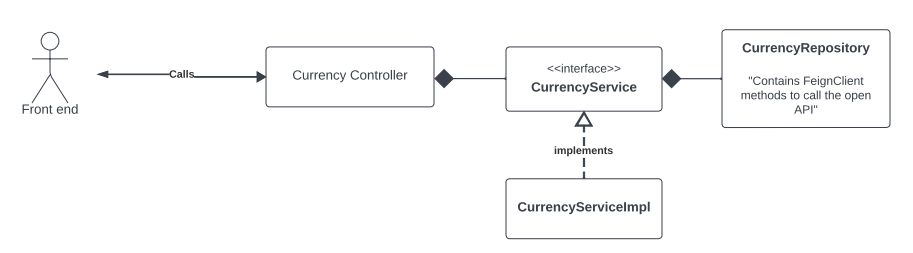

# Currency Graduation Project for Banque Misr Internship

### Project Info 
- Java version : `17`
- Spring version : `3.1.2`
- Dependencies used :
  - Spring Boot Web Dependency
    ```Java
  
     <dependency>
              <groupId>org.springframework.boot</groupId>
              <artifactId>spring-boot-starter-web</artifactId>
     </dependency>
    ```
  - Open Feign Client
    ```Java
    <dependency>
            <groupId>org.springframework.cloud</groupId>
            <artifactId>spring-cloud-starter-openfeign</artifactId>
    </dependency>
    ```
  - Lombok Annotation
    ```Java
    <dependency>
            <groupId>org.projectlombok</groupId>
            <artifactId>lombok</artifactId>
            <optional>true</optional>
    </dependency>
    ```
  - Swagger
    ```Java
    <dependency>
        <groupId>org.springdoc</groupId>
        <artifactId>springdoc-openapi-starter-webmvc-ui</artifactId>
        <version>2.0.3</version>
    </dependency>
    ```
    
****

### Project UML Diagram



- **CurrencyRepository**: will contain all method for calling the OpenApi for currency conversion using `FeignClient`.
- **BaseCurrencyService** : interface for creating a template for defining methods for dealing with `CurrencyRepository`.
- **CurrencyService** : holds the implementation of the `BaseCurrencyService` and its methods.
- **CurrencyController** : the main controller of our backend service containing all endpoints for accessing our resources and services.

### Open APIs used:
- https://exchangeratesapi.io/documentation/

### APIs Contracts

[//]: # (Will defined later .....)
- **This section will contain all endpoints with all needed information
to make a contract between us as Backend side and Frontend/IOS/Android side to use our services.**
- **Each endpoint will have :**
  - HTTP method.
  - base url.
  - path.
  - parameters -optional-
  - headers -optional-
  - body -in specific methods-
  - sample of each request and response.
  - all possible status codes.

### Swagger Documentation :

[//]: # (Will Add swagger documenation link)


## Architecture of Currency Conversion API
- **Base Url** = ```https://graduationprojectbm.up.railway.app```
## <mark style="background: #FFB86CA6;">1- Conversion Api</mark>

### Api Contract :
```
GET : {{base_url}}/api/v1/currency/convert
	?src={from_currency}
	&des1={to_currency}
	&amount={amount}
```

### Request Example :
```
GET : localhost:8080/api/v1/currency/convert
	?src=KWd
	&des=egp
	&amount=2
```

### Response Example :
```
{
    "source": "KWD",
    "destination": "EGP",
	"amount": 200.63500376
}
```

### Open Api called :

```
Base : {{base_url}}/pair/{from}/{to}/{amount}

Example : {{base_url}}/pair/USD/EGP/2.5
```

****

## <mark style="background: #FFB86CA6;">2- Compare API</mark>

### Api Contract :
```
GET : {{base_url}}/api/v1/currency/convert
	?src={from_currency}
	&des1={to_currency_1}
	&des2={to_currency_2}
	&amount={amount}
```

### Request Example :
```
GET : localhost:8080/api/v1/currency/convert
	?src=KWD
	&des1=EGP
	&des2=USD
	&amount=2
```

### Response Example :
```
{
    "source": "KWD",
    "destination1": "EGP",
    "destination2": "USD"
	"amount1": 200.63500376,
	"amount2":32.566
}
```

### OpenApi called :

***We will call the same API in Convert but ==twice==
First One : src + des1
Second One : src + des2***

```
Base : {{base_url}}/pair/{from}/{to}/{amount}

Example : 
	{{base_url}}/pair/KWD/EGP/2.5
	{{base_url}}/pair/KWD/USD/2.5
```

****

## <mark style="background: #FFB86CA6;">3- Rate Compare</mark>

### Api Contract :


***POST : to send request body for all currencies .***

```

POST : {{base_url}}/api/v1/currency/

Body : {
	"base" : "egp",
	"currencies" : [
			"USD",
			"EUR"
	]
}
```

### Request Example :
```
// For example : we have KWD and 3 currencies as favorites : USD , EGP , EUR

POST : localhost:8080/api/v1/currency/

Body : {
	"base" : "KWD",
	"currencies" : [
		"USD",
		"EGP",
		"EUR"
	]
}
```

### Response Example :
```
{
    "base": "KWD",
    "destinations" : [
		{
			"code" : "EGP",
			"country" : "Egyption Pound",
			"imageUrl" : ".....",
			"rate" : 100.5566
	    },
	    {
		    "code" : "USD",
		    "country" : "United States Dollar",
		    "imageUrl" : ".....",
		    "rate" : 16.39
	    },
	    {
		    "code" : "EUR",
		    "country" : "Euro",
		    "imageUrl" : ".....",
		    "rate" : 42.5566
	    }
    ]
}
```

### Open Api called :

***After calling the `/latest` endpoint we will get the full list of all currencies around the world. Then we should `filter` them based on the given list of currencies.***

```
Base : {{base_url}}/latest/{currency}

Example : 
	{{base_url}}/latest/KWD
	
```


****

## <mark style="background: #FFB86CA6;">4- Get All Currencies</mark>

### Api Contract :
```
GET : {{base_url}}/api/v1/currency
```

### Request Example :
```
GET : localhost:8080/api/v1/currency
```

### Response Example :
```json
{
	[
		{
			"code" : "EGP",
			"country" : "Egyption Pound",
			"imageUrl" : ".....",
	    },
	    {
		    "code" : "USD",
		    "country" : "United States Dollar",
		    "imageUrl" : ".....",
	    },
	    {
		    "code" : "EUR",
		    "country" : "Euro",
		    "imageUrl" : ".....",
	    },
    ]
}
```


***==There is no Open APIs needed , only static data!!==***

****

## Design Patterns used

### Adapter Design Pattern

#### Problem
We call outsource open API Service that return the response of data with such format, the problem is **Our Service expect and wait the response with different format to deal with it.**

#### Solution
You can create an **Adapter**. This is a special object that converts the interface of one object so that another object can understand it.<br>
An **Adapter** wraps one of the objects to hide the complexity of conversion happening behind the scenes. The wrapped object isn’t even aware of the adapter.

#### Adapter Design Pattern UML


****

## Testing 
Using `JUnit5` and `Mockito`.
### Types of testing:
1. **Unit Test**
   - test the ```CurrncyServiceImpl``` to ensure that the functionality of dealing with `FeignClient` is effective + testing the **Caching** methods.
   - test the ```CurrencyController``` before deploying the API to make sure that all status codes and api responses working successfully.

****

## Caching 
- Using in-memory cache on the server itself.
- Using `Caffeine` for Caching Configuration and for customizing the `CachingConfig`.

#### Why we don't use **Redis Server** for caching instead of in-memory cache ??
- **Redis** is independent server for applying the caching , it gives us a lot of functionalities for configure the caching like multiple Datastructures and scheduling tasks .
- But our project is very simple , doesn't have any databases or heavy work that needs the power of **Redis** in caching.
- Our cache operations are very simple and can be implemented easily with in-memory cache.
- On the other side , **Redis** needs to deployment process specifically for it.
- So , we have trade-offs , and our decision goes for simplicity over functionality.